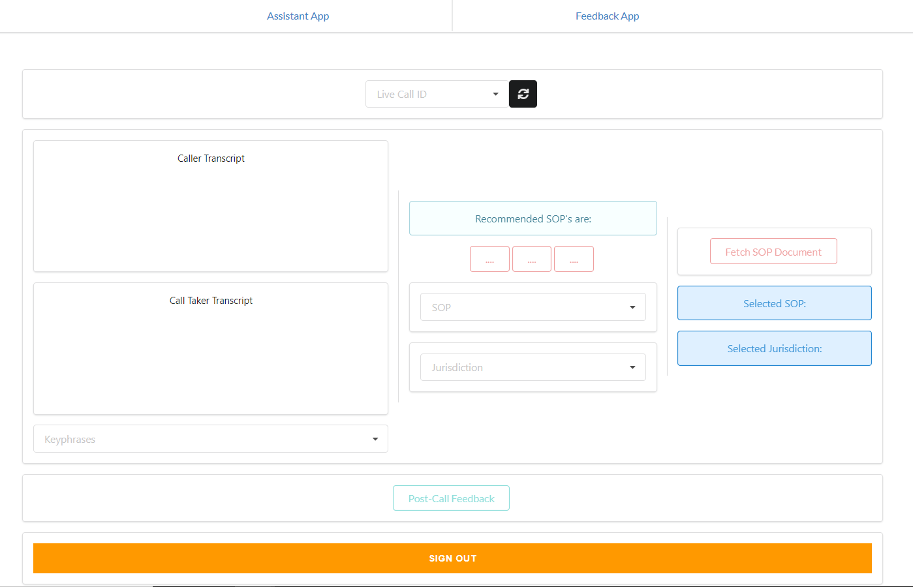
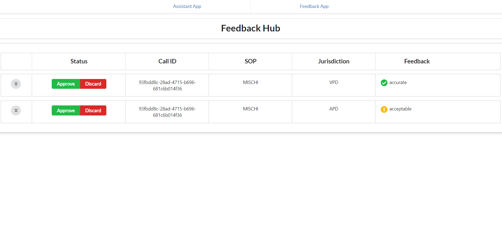
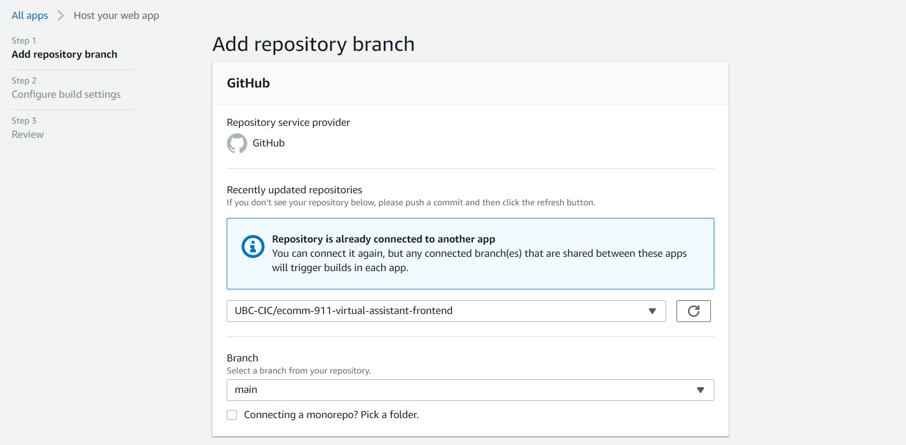
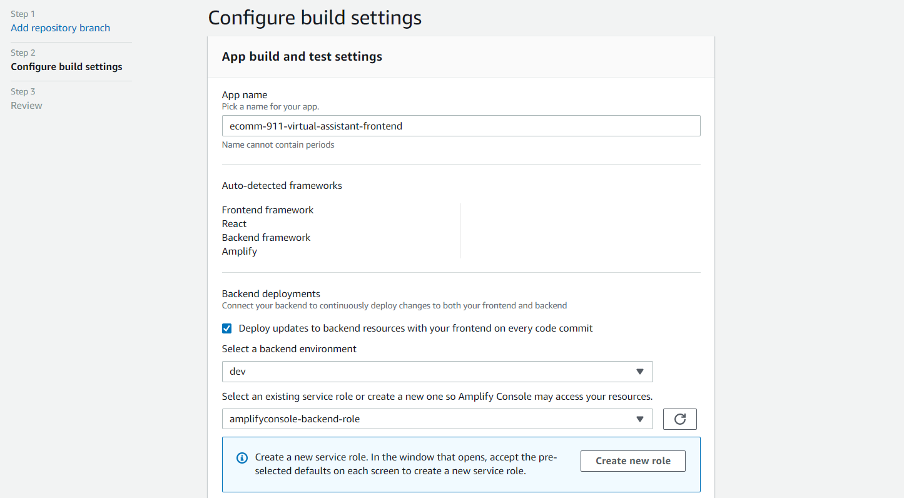
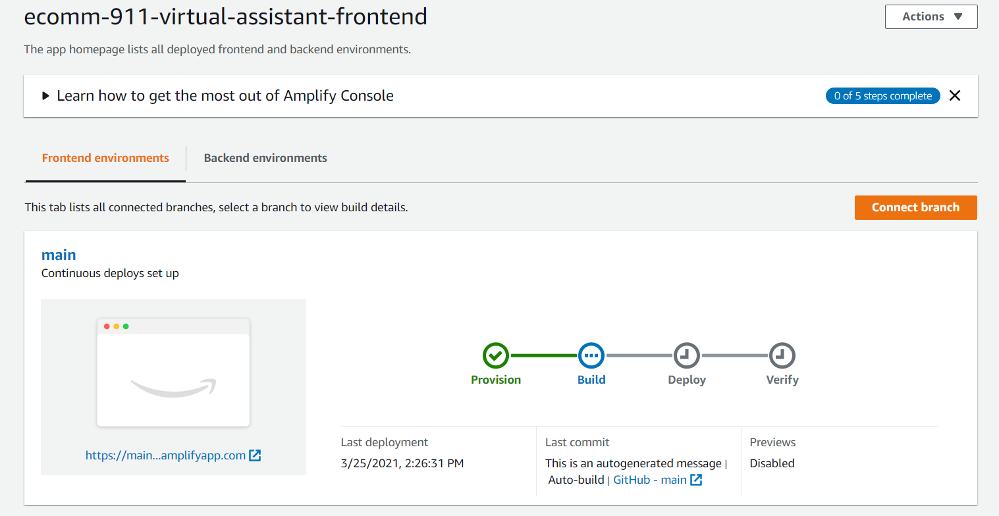

# Virtual Assistant - Frontend
Frontend for the ecomm911 virtual assistant app for non-emergency call takers

## Project Overview

A single page [React application](https://github.com/facebook/create-react-app) that connects to the virtual assistant
backend.

## Deployment

The deployment is similar to that of the call transcriber frontend, as usual you will need the following:
* [AWS Account](https://aws.amazon.com/account/)
* [GitHub Account](https://github.com)

1) Fork and clone this repository into your Github account.
2) From the AWS Amplify page in the AWS Console, select **Host web app** under the **New app** dropdown, and select Github as the repository option.
3) After authenticating into your Github account, select the forked repository under the repository dropdown. Leave the default branch as is.
   NOTE: You will need to give permissions to the Amplify service to access your github account if not already done
   
4) On the next page, **App build and test settings**, keep the default build settings. You can rename the app name.
5) Select **Create new environment** under the **Select a backend environment** dropdown and make sure to name it as **dev** (some stack deployment relies on this name), and select your AWS Amplify service role in the following dropdown if one exists; if not, Select 'Create new role' and quickly create one using the default settings and refresh the role selection.
   
6) Review the settings and click **Save and deploy**, and wait for the deployment build to complete, which will take some time.
   

Within Amplify Console, you should see an auto-generated URL under **Frontend environment** - that is the URL used to access the frontend build. You can now create your user accounts and log in via the URL.

## Architecture

Using AWS Amplify, this project has the following configured backend resources:
* [Cognito authentication](https://docs.amplify.aws/lib/auth/getting-started/q/platform/js) featuring user pools
* A DynamoDB table to store feedback details for a particular call that was submitted with the very same app
* A [GraphQL API](https://docs.amplify.aws/guides/api-graphql/building-a-form-api/q/platform/js) that allows querying data to and from the aforementioned feedback table

## Logging in

Cognito is used to authenticate users into the frontend and integrates with . Users only require their name and a strong password to create an account.
After account creation, users will need to verify their account by inputting the 6-digit verification code that was sent to their provided email address before being able to log in to the system.

## Next Steps

* The SOP Button onClick() handlers can be updated to use the button data and fetch the SOP document, for example by fetching a sharepoint website URL.