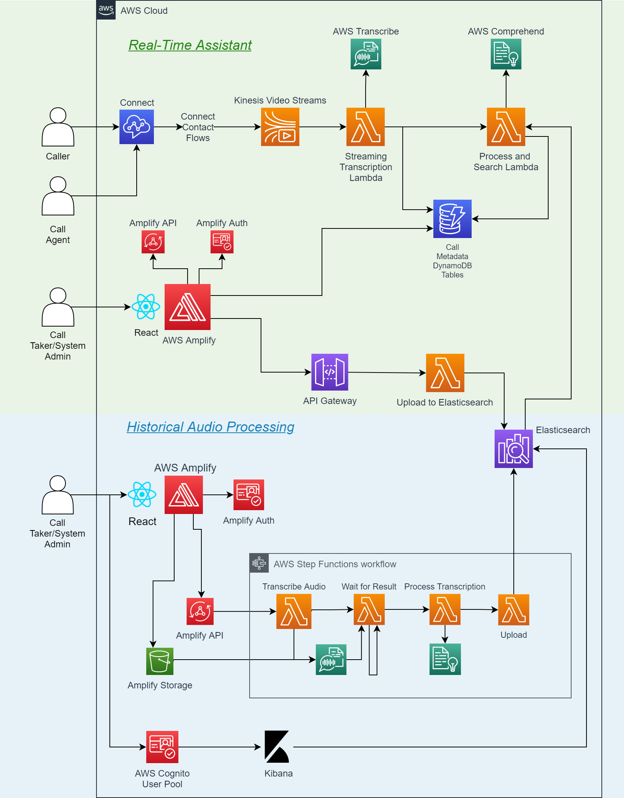

# E-Comm 911 Connect Virtual Assistant

## Project Summary

The E-Comm 911 Connect Virtual Assistant tool serves to assist non-emergency call takers in identifying the nature and
scenario of incoming calls and moving ahead with the correct standard procedures, leading to increase in overall
efficiency and accuracy in call-taking. Procedure recommendations are based on keyphrase similarity in ElasticSearch
between the currently transcribed call and transcripts of audio call files provided by the user.

## High-level Architecture

## Stack Documentation and Deployment Guides

[Audio Processing Backend Stack Deployment](https://github.com/UBC-CIC/ecomm-911-historical-audio-processing/blob/master/backend/backend-README.md)
[Audio Processing Frontend Stack Deployment](https://github.com/UBC-CIC/ecomm-911-historical-audio-processing/blob/master/frontend-README.md)
[Real-Time Assistant Backend Stack Deployment](backend/backend-README.md)\
[Real-Time Assistant Frontend Stack Deployment](frontend-README.md)

## Credits
This prototype was coded and architected by Colin Zhang, with guidance from the UBC CIC tech and project teams
and with quoted usage and reference to some AWS sample template projects. The prototype was further refined by
Neelim Novo and Sathvik Radhakrishnan, with the addition of the Real-Time Assistant being designed and developed by them.

## License
This project is distributed under the [MIT License](./LICENSE).
