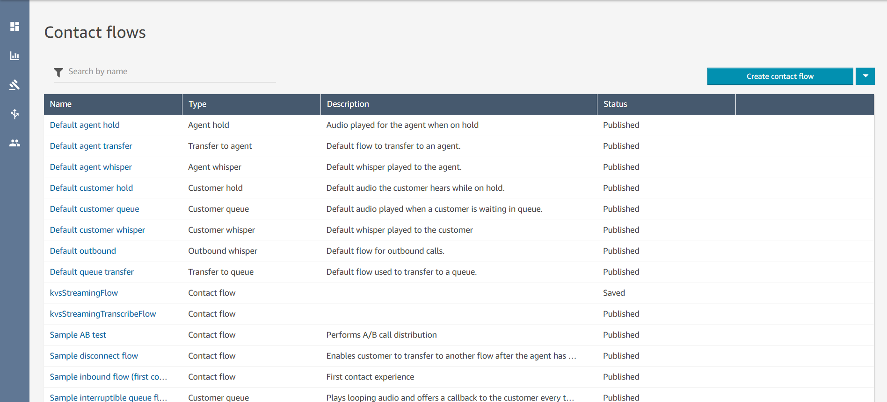
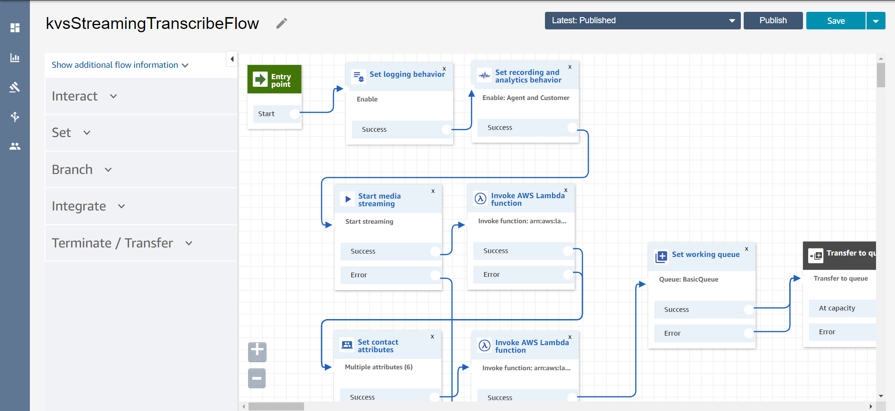
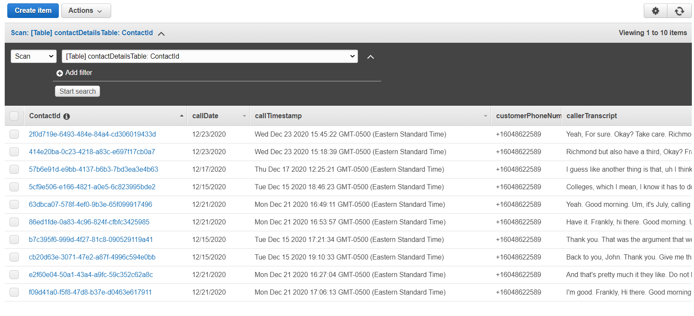

# E-Comm 911 Real-Time Assistant (Part 2)

## Project Overview
The second half of the E-Comm 911 call center virtual assistant Proof of Concept - this stack initializes the 
resources that receives and transcribes the incoming caller and call taker audio from the AWS Connect instance in 
near-real time, and queries the results against the Elasticsearch Cluster deployed in the previous stack to retrieve the 
most appropriate Standard Operating Procedure for based on document similarity. This portion of the solution leverages 
Amazon Connect, Amazon Transcribe, Amazon Comprehend, AWS Lambda, DynamoDB, and (indirectly) Amazon Kinesis Video Streams.

## Deployment Steps
1) Create an S3 bucket to upload deployment files with the following command, or re-use the same bucket you created in 
   the previously deployed stack:
```
aws s3api create-bucket --bucket <YOUR-BUCKET-NAME> --create-bucket-configuration LocationConstraint=<YOUR-REGION> --region <YOUR-REGION>
```
2) Set up an instance of Amazon Connect from the AWS console. Details on instance creation can be 
   found [here](https://docs.aws.amazon.com/connect/latest/adminguide/tutorial1-create-instance.html).
3) In that same created instance, **enable live media streaming** so that it supports the start/stop media streaming 
   contact flow blocks that are required in the contact flows (workflow once an Amazon Connect number is called). 
   Instructions for enabling this can be 
   found [here](https://docs.aws.amazon.com/connect/latest/adminguide/enable-live-media-streams.html).
4) Clone the git repository into your local directory if you haven't already. Within this directory, change directory into 
   the ```./backend/deployment``` folder, and run the following command to upload the zipped lambdas to your bucket:
```
aws s3 sync . s3://<YOUR-BUCKET-NAME>/deployment --region <YOUR-REGION> --profile <YOUR-PROFILE>
```
5) In this subdirectory with the template.yaml file, i.e`(./backend)`, run the following 
   AWS Cloudformation command to deploy the stack:
```
aws cloudformation deploy --capabilities CAPABILITY_IAM --template ./template.yaml --stack-name <STACK-NAME> --parameter-overrides audioFileTranscribeStack=<PREVIOUS-STACK-NAME> existingS3BucketName=<DEPLOYMENT-BUCKET-NAME> --profile <YOUR-PROFILE> --region <YOUR-REGION>
``` 
6) A new S3 bucket will be created during deployment (has the format 
   `<STACK-NAME>-createS3bucket-XXXXXXXXXX`, the bucket name is also in the Outputs tab of this Cloudformation stack in 
   the Cloudformation Console) and will contain a sample contact flow to be imported into AWS Connect. 
   Navigate to the newly created S3 bucket and download the contact flow, which is essentially a JSON file.
7) Login to your Amazon Connect instance. Select **Contact Flows** under Routing on the left sidebar, and click 
   on **Create Contact Flow**.

8) Select **Import flow (beta)** under the Save dropdown and select the downloaded file. Save and publish.

9) Select **Phone numbers** under the Routing on the left sidebar, then click **Claim a number**. Select a number 
   (or use a ported phone number) and select the recently created contact flow under Additional Options and press 
   **Save** to map the contact flow to the number. Calling the number will trigger the contact flow and start transcription.


Contact flows define flow logic in AWS Connect; the sample contact flow created during deployment has all the 
functionality needed to initialize audio streaming and trigger the Transcribe lambda function and the rest of the 
workflow. The caller is transferred to a basic queue as default behaviour after triggering, so handling incoming 
callers is can be customized and integrated according to the user's needs.

## Build Steps
CloudFormation and build infrastructure were mostly unchanged from the original template project. Lambdas for helper 
functions were pre-packaged, and Gradle is required to build the Java lambda function responsible for the real time 
transcription. Instructions to install Gradle can be found [here](https://gradle.org/install/) by following the steps 
under the 'Installing manually' section. \
To build the Java Lambda, run ```gradle build``` in the current subdirectory. This will build the dependencies 
specified in the build.gradle file with the java lambda code in ```backend/src``` and zip it up into a package for deployment; 
this package will be found in the ```backend/build/distributions``` folder on a successful build.

## Project Architecture
* The main Java lambda function is located in the ```backend/src``` folder. It takes in metadata from Kinesis Video Streams 
  and Connect, as well as some parameters defined within the contact flow which can be modified. The transcription 
  starts when ```TranscribeStreamingRetryClient``` class calls ```startStreamTranscription```, and the function will 
  run asynchronously and send segments of audio to AWS Transcribe. When transcript segments are received, 
  The ```StreamTranscriptionBehaviorImpl``` class handles the responses and ```TranscribedSegmentWriter``` class writes 
  the transcript into DynamoDB and aggregates it over time.
* Helper functions included from the template project that assist in initializing the call entry in 
  the ```ContactDetails``` DynamoDB table (which will contain call metadata from Connect including caller number and 
  date, the caller transcript and the results for the jurisdiction and top three SOPs), triggering the above mentioned 
  Java lambda, and creating the sample contact flow and storing it in an S3 bucket within a custom CFN resource. These 
  helpers are found in the ```backend/functions``` folder.
* The ```process_transcript``` lambda function in the ```backend/functions``` folder that is triggered by updates to the 
  DynamoDB transcript tables. It extracts location entities and key phrases from the transcript, and performs a 
  'more like this' query for similarity against other stored call transcripts to retrieve the top three SOPs. This 
  lambda function will then write the results to the ```ContactDetails``` DynamoDB table.


## ElasticSearch
As mentioned before, use of ElasticSearch is integrated for SOP (Standard Operating Procedure) search recommendation. 
An AWS ElasticSearch Service Cluster is deployed as part of the audio file transcription workflow stack to store 
documents of individual call transcripts with annotated metadata received from the frontend. \
The [elasticsearch-py client](https://elasticsearch-py.readthedocs.io/en/v7.10.1/) is imported and used to connect 
into the ElasticSearch domain, create the index and insert new documents for audio call files into the index, as well 
as performing search queries on the index to retrieve results during real-time calls. \
For the query, 
the ["More Like This" query](https://www.elastic.co/guide/en/elasticsearch/reference/current/query-dsl-mlt-query.html), 
which performs searches based on likeness to a given input, is quite suitable for this scenario. more information 
on this query and its input parameters can found in the elasticsearch query DSL docs, linked above. Currently, 
the 'like' parameter is being set to the full caller-side transcript, although an array of extracted key phrases can 
also work but may not be accurate as some important words are not detected as key phrases by Comprehend. Term 
selection parameters are edited so that more terms in the input will be considered for 'more like this' comparison, 
and stop words may also be defined.

## Future Development Considerations
The next steps for finishing this project would be the first two points.
* Accuracy of extracting locations via AWS Comprehend will depend on voice quality and clarity in calls. In addition, 
  not all city names will be detected as location type entities. 
* Custom vocabularies may be able to reinforce streaming transcriptions, similar to transcription jobs as well as a custom
  model for Amazon Transcribe
* Parameters in the Elasticsearch query may be changed or enhanced to improve the search.

## Credits
This portion of the solution was based on and modified from 
the [Amazon Connect Realtime Transcription Project](https://github.com/amazon-connect/amazon-connect-realtime-transcription) 
by the team at the UBC Cloud Innovation Centre.